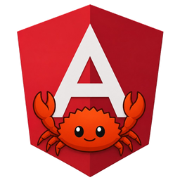
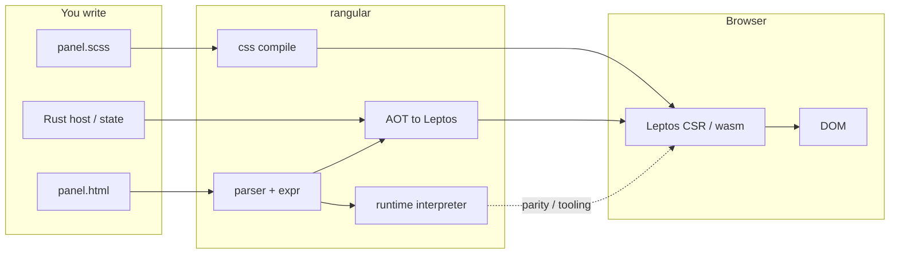
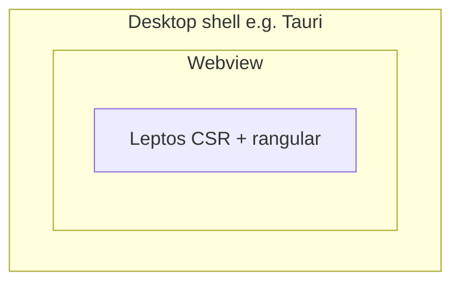

# [**rangular**](https://github.com/Interchouette-ITC/rangular)

<p align="center">
  
</p>

<p align="center">
  <strong>Angular-shaped templates. Rust controllers. Browser DOM.</strong>
</p>

Write markup in familiar `.html` / `.scss`, keep state and handlers in Rust, and
render with [Leptos](https://leptos.dev/) in the browser (CSR / Trunk / wasm).

If you know Angular component files, you will feel at home. If you know Rust,
you keep ownership of the real logic. **[rangular](https://github.com/Interchouette-ITC/rangular)**
sits between the two: a **versioned subset**, not a full Angular port, with
diagnostics (`RANG*`) instead of panics on bad template text.

Production builds use **AOT** lowering to Leptos. A **runtime** interpreter
shares the same AST for parity tests and tooling.

## What you get today

Author panels as Angular-shaped files; **[rangular](https://github.com/Interchouette-ITC/rangular)**
turns them into Leptos views for the browser. Production prefers **AOT**; the
**runtime** keeps the same AST for tests and tooling.



| Piece                | Role today                                                                      |
| -------------------- | ------------------------------------------------------------------------------- |
| Language             | v0.1 contract in [`docs/SPEC.md`](docs/SPEC.md)                                 |
| Parser / expr / host | Core subset                                                                     |
| AOT                  | `rangular-aot` + `rangular-macros`                                              |
| Runtime              | `rangular-runtime` (parity / tooling)                                           |
| SCSS                 | `rangular-css` (`compile_scss` or encapsulate; Bootstrap utilities stay global) |
| Registry             | Panel tags + typed `provide` / `inject`                                         |
| Growth               | Fixture corpus in [`tests/fixtures/`](tests/fixtures/)                          |

Honest subset, not full Angular. New syntax lands through fixtures and semver.
Unsupported input yields `RANG*` diagnostics; templates must never panic the process.

## Use it in your project

Not on [crates.io](https://crates.io/) yet. Until then, depend on git `dev`
(or a sibling path checkout). You need a [Leptos](https://leptos.dev/) CSR app
(Trunk / wasm) and a `build.rs` that compiles each panel.

### Cargo (git)

```toml
[dependencies]
leptos = { version = "0.8", features = ["csr"] }
rangular-aot = { git = "https://github.com/Interchouette-ITC/rangular.git", branch = "dev" }
rangular-host = { git = "https://github.com/Interchouette-ITC/rangular.git", branch = "dev" }

[build-dependencies]
rangular-aot = { git = "https://github.com/Interchouette-ITC/rangular.git", branch = "dev" }
rangular-css = { git = "https://github.com/Interchouette-ITC/rangular.git", branch = "dev" }
```

Pin a commit with `rev = "…"` when you want a frozen tree. A local clone works
the same way:

```toml
rangular-aot = { path = "../rangular/crates/rangular-aot" }
rangular-css = { path = "../rangular/crates/rangular-css" }
rangular-host = { path = "../rangular/crates/rangular-host" }
```

### Panels

Keep one folder per panel (see
[`tests/fixtures/components/`](tests/fixtures/components/) for real examples:
`color-field`, `chrome-header`, `asset-icon`). Each panel is `.html` + `.scss`
plus a Rust host. In `build.rs`, compile HTML with `rangular_aot::compile_named`
and SCSS with `rangular_css::compile_scss` (flat CSS for Leptos CSR). Write the
AOT Rust to `OUT_DIR/rangular/{fn_name}.rs`.

```rust
let aot = rangular_aot::compile_named(
    &html,
    "src/components/color_field/color_field.html",
    "color_field_view",
);
std::fs::write(out_dir.join("color_field_view.rs"), &aot.code)?;
```

In the panel module, `include!` that file, implement `rangular_host::Host`, wrap
state in `HostCell`, and call the generated view:

```rust
include!(concat!(env!("OUT_DIR"), "/rangular/color_field_view.rs"));

let host = HostCell::new(ColorFieldHost { /* signals */ });
color_field_view(host)
```

Language details: [`docs/SPEC.md`](docs/SPEC.md). Layout of fixtures:
[`tests/fixtures/README.md`](tests/fixtures/README.md).

## Goals

| Goal               | Approach                                               |
| ------------------ | ------------------------------------------------------ |
| Markup out of Rust | External templates; no panel `view!` in controllers    |
| Familiar authoring | Angular-shaped bindings, `@if` / `@for`, component CSS |
| Web-native         | [Leptos](https://leptos.dev/) CSR on wasm              |
| Safe parsing       | Diagnostics on bad input; no panic on template text    |

## Browser first (and what that means)

**v0.1 targets the browser DOM.** That is the contract in
[`docs/SPEC.md`](docs/SPEC.md): Leptos CSR / wasm. Native desktop widget toolkits
are **out of scope**.

### Want Angular-like on the desktop?

Look at [Angust](https://github.com/TudorOrban/Angust) (native / desktop-oriented
components and HTML templates) and the [Angular Rust](https://github.com/angular-rust)
ecosystem. Different stack, useful reading; not what
**[rangular](https://github.com/Interchouette-ITC/rangular)** implements.

### Shipping a desktop app anyway?

[Tauri](https://v2.tauri.app/) (and similar shells) host a **webview**. Your UI
is still a web app. A Leptos + Trunk build that uses
**[rangular](https://github.com/Interchouette-ITC/rangular)** panels can run
inside that webview the same way it runs in Chrome. That is an **indirect**
desktop path: **[rangular](https://github.com/Interchouette-ITC/rangular)** still
speaks DOM / wasm, not egui / iced / GTK.



No Tauri-specific crate in this repo today. If your frontend already works under
Trunk, you are most of the way there.

## Working on this repo


```bash
make check   # cargo check --workspace
make lint    # fmt + clippy
make test    # workspace tests (includes parity)
make ci      # lint + test + no-panic garbage fixtures
```

How to add fixtures: [`tests/fixtures/README.md`](tests/fixtures/README.md) and
[`docs/CONTRIBUTING.md`](docs/CONTRIBUTING.md).

## Workspace

| Crate              | Role                                         |
| ------------------ | -------------------------------------------- |
| `rangular-parser`  | HTML + Angular syntax → AST                  |
| `rangular-expr`    | Expression AST and evaluation                |
| `rangular-css`     | Component SCSS, `:host`, encapsulation       |
| `rangular-host`    | get / set / call / events                    |
| `rangular-aot`     | Compile-time lowering to Leptos              |
| `rangular-macros`  | `rangular_template!` (includes build output) |
| `rangular-runtime` | Interpret AST at runtime                     |
| `rangular`         | Facade + panel registry                      |

## Roadmap

- Keep AOT and runtime aligned on the fixture corpus
- Grow the subset only when fixtures land
- Content projection / slots for layout shells
- Stronger host typing and event payloads
- crates.io when the v0.1 surface is stable

## Docs

<p align="center">
  
</p>

- [`docs/SPEC.md`](docs/SPEC.md) - language contract (in / out of scope)
- [`docs/CONTRIBUTING.md`](docs/CONTRIBUTING.md) - fixtures and PR habits
- [`docs/README.md`](docs/README.md) - docs index and related projects

The shield + [Ferris](https://rustacean.net/) mark is a friendly project logo.

## License

Apache-2.0. See [`LICENSE`](LICENSE).
