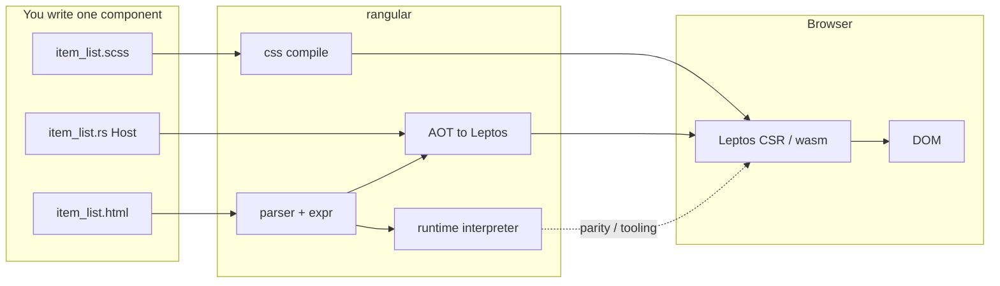
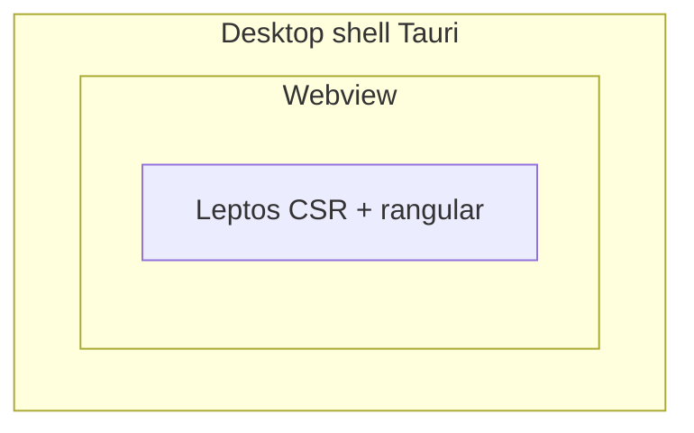

# [**rangular**](https://github.com/Interchouette-ITC/rangular)

<p align="center">
  
</p>

<p align="center">
  <strong>Angular-shaped templates. Rust controllers. Browser DOM.</strong>
</p>

Write markup in familiar `.html` / `.scss`, keep state and handlers in Rust, and
render with [Leptos](https://leptos.dev/) in the browser (CSR / Trunk / wasm).

**Live:** [https://rangular.interchouette.net](https://rangular.interchouette.net)

Pre-built desktop demos: **[GitHub Releases](https://github.com/Interchouette-ITC/rangular/releases)** (Linux `.deb` / AppImage, Windows NSIS). macOS not in v1.

If you know Angular component files, you will feel at home. If you know Rust,
you keep ownership of the real logic. **[rangular](https://github.com/Interchouette-ITC/rangular)**
sits between the two: a **versioned subset**, not a full Angular port, with
diagnostics (`RANG*`) instead of panics on bad template text.

Production builds use **AOT** lowering to Leptos. A **runtime** interpreter
shares the same AST for parity tests and tooling.

## What you get today

Author **components** as Angular-shaped files; **[rangular](https://github.com/Interchouette-ITC/rangular)**
turns them into Leptos views for the browser. Production prefers **AOT**; the
**runtime** keeps the same AST for tests and tooling.



| Piece                | Role today                                                                      |
| -------------------- | ------------------------------------------------------------------------------- |
| Language             | v0.1 contract in [`SPEC.md`](SPEC.md)                                 |
| Parser / expr / host | Core subset                                                                     |
| AOT                  | `rangular-aot` + `rangular-macros`                                              |
| Runtime              | `rangular-runtime` (parity / tooling)                                           |
| SCSS                 | `rangular-css` (`compile_scss` or encapsulate; Bootstrap utilities stay global) |
| Registry             | Component tags + typed `provide` / `inject`                                     |
| Growth               | Fixture corpus in [`tests/fixtures/`](../tests/fixtures/) (tests; not the demo) |
| Demo                 | [`demo-leptos/`](../demo-leptos/) dogfoods AOT with its own panels                           |

Layers: `tests/fixtures/` is the language growth corpus for crate tests; `demo-leptos/` is an independent dogfood app with its own panels; other rangular apps live out of this tree.

Honest subset, not full Angular. New syntax lands through fixtures and semver.
Unsupported input yields `RANG*` diagnostics; templates must never panic the process.

## One component = three files

Same habit as Angular, with **`.rs` instead of `.ts`**:

| File             | Angular habit        | Here                                              |
| ---------------- | -------------------- | ------------------------------------------------- |
| `item_list.html` | template             | Angular-shaped markup (`{{ }}`, `@for`, bindings) |
| `item_list.scss` | component styles     | `:host`, nesting, `&`                             |
| `item_list.rs`   | class / component.ts | Rust `Host` + Leptos `#[component]`               |

```text
demo-leptos/src/components/item_list/
  item_list.html    # familiar Angular-shaped template
  item_list.scss    # familiar component SCSS
  item_list.rs      # state + handlers
```

Live Host example: [`demo-leptos/src/components/item_list/`](../demo-leptos/src/components/item_list/).
Growth corpus (tests only): [`tests/fixtures/components/`](../tests/fixtures/components/).

**Template** (`item_list.html`):

```html
<section class="item-list" aria-label="Items">
  <h2>{{ title }}</h2>
  <ul>
    @for (item of items; track item) {
    <li>{{ item }}</li>
    }
  </ul>
</section>
```

**Styles** (`item_list.scss`):

```scss
:host {
  display: block;
}

.item-list {
  h2 {
    margin: 0 0 0.55rem;
  }

  ul {
    list-style: none;
    margin: 0;
    padding: 0;
  }
}
```

SCSS is compiled **in Rust** by [`grass`](https://crates.io/crates/grass)
(a Sass implementation). No Node / `sass` CLI. `rangular_css::compile_scss`
calls `grass::from_string` at build time and emits flat CSS for the browser.
`encapsulate` does the same compile, then applies emulated `:host` / scoping
when you need that path.

**Rust host** (`item_list.rs`) - implement `Host`, wrap signals, call the
generated view from Leptos:

```rust
use leptos::prelude::*;
use rangular_aot::HostCell;
use rangular_host::{Host, HostError, Value};

include!(concat!(env!("OUT_DIR"), "/rangular/item_list_view.rs"));

#[component]
pub fn ItemList(
    title: RwSignal<String>,
    items: RwSignal<Vec<String>>,
) -> impl IntoView {
    item_list_view(HostCell::new(ItemListHost { title, items }))
}

struct ItemListHost {
    title: RwSignal<String>,
    items: RwSignal<Vec<String>>,
}

impl Host for ItemListHost {
    fn get(&self, name: &str) -> Option<Value> {
        match name {
            "title" => Some(Value::Str(self.title.get())),
            "items" => Some(Value::List(
                self.items
                    .get()
                    .into_iter()
                    .map(Value::Str)
                    .collect(),
            )),
            _ => None,
        }
    }

    fn call(&mut self, _: &str, _: &[Value]) -> Result<Value, HostError> {
        Ok(Value::Unit)
    }
}
```

That is the whole idea: **`.html` + `.scss` + `.rs`**. Leptos only mounts the
component; it does not embed the markup.

### Wire AOT in `build.rs`

Once per component, compile the template (and SCSS) at build time. Generated
Rust lands under `OUT_DIR/rangular/` for the `include!` above.

```rust
let html = std::fs::read_to_string("src/components/item_list/item_list.html")?;
let aot = rangular_aot::compile_named(
    &html,
    "src/components/item_list/item_list.html",
    "item_list_view",
);
std::fs::write(out_dir.join("item_list_view.rs"), &aot.code)?;

let scss = std::fs::read_to_string("src/components/item_list/item_list.scss")?;
let css = rangular_css::compile_scss(&scss); // flat CSS for Leptos CSR
// append css.css into your app stylesheet
```

Language details: [`SPEC.md`](SPEC.md). Fixture layout:
[`../tests/fixtures/README.md`](../tests/fixtures/README.md).

## Use it in your project

Not on [crates.io](https://crates.io/) yet. Until then, depend on git `dev`.
You need a [Leptos](https://leptos.dev/) CSR app (Trunk / wasm) and a `build.rs`
that compiles each component (see above).

### Cargo (git)

```toml
[dependencies]
leptos = { version = "0.8", features = ["csr"] }
rangular-aot = { git = "https://github.com/Interchouette-ITC/rangular.git", branch = "dev" }
rangular-host = { git = "https://github.com/Interchouette-ITC/rangular.git", branch = "dev" }

[build-dependencies]
rangular-aot = { git = "https://github.com/Interchouette-ITC/rangular.git", branch = "dev" }
rangular-css = { git = "https://github.com/Interchouette-ITC/rangular.git", branch = "dev" }
```

Pin a commit (`rev`) or use a local path checkout: see
[`CONTRIBUTING.md`](CONTRIBUTING.md#depend-from-a-local-clone-or-pin-a-commit).

## Goals

| Goal               | Approach                                                |
| ------------------ | ------------------------------------------------------- |
| Markup out of Rust | External templates; no component `view!` in controllers |
| Familiar authoring | Angular-shaped bindings, `@if` / `@for`, component CSS  |
| Web-native         | [Leptos](https://leptos.dev/) CSR on wasm               |
| Safe parsing       | Diagnostics on bad input; no panic on template text     |

## Browser first (and what that means)

**v0.1 targets the browser DOM.** That is the contract in
[`SPEC.md`](SPEC.md): Leptos CSR / wasm. Native desktop widget toolkits
(egui, iced, GTK, and similar) are **out of scope**.

### Shipping a desktop app with rangular

[Tauri](https://v2.tauri.app/) hosts a **webview**. Your UI is still a web app: a
Leptos + Trunk build that uses rangular components can run inside that webview
the same way it runs in Chrome. rangular still speaks DOM / wasm, not egui /
iced / GTK.

Pre-built installers (Linux `.deb` / AppImage, Windows NSIS) ship on
**[GitHub Releases](https://github.com/Interchouette-ITC/rangular/releases)**.
macOS is not in v1.

Local shell (same SPA as the browser demo):

```bash
make demo-tauri
make demo-tauri-build   # Linux deb/AppImage, Windows NSIS
```

Details: [`../demo-tauri/README.md`](../demo-tauri/README.md).



### Browser demo (live)

Dogfood app with colocated `html` / `scss` / `rs` panels (not the fixture corpus):

```bash
make demo
# → http://127.0.0.1:4180/
```

Docker (same SPA, nginx):

```bash
docker pull interchouette/rangular-demo:latest
docker run --rm -p 8080:8080 interchouette/rangular-demo:latest
```

Live: [https://rangular.interchouette.net](https://rangular.interchouette.net)

Details: [`../demo-leptos/README.md`](../demo-leptos/README.md).

## Working on this repo

```bash
make check   # cargo check --workspace
make lint    # fmt + clippy
make test    # workspace tests (includes parity)
make ci      # lint + test + no-panic garbage fixtures
```

How to add fixtures: [`../tests/fixtures/README.md`](../tests/fixtures/README.md) and
[`CONTRIBUTING.md`](CONTRIBUTING.md).

## Workspace

| Crate              | Role                                         |
| ------------------ | -------------------------------------------- |
| `rangular-parser`  | HTML + Angular syntax → AST                  |
| `rangular-expr`    | Expression AST and evaluation                |
| `rangular-css`     | Component SCSS, `:host`, encapsulation       |
| `rangular-host`    | get / set / call / events                    |
| `rangular-aot`     | Compile-time lowering to Leptos              |
| `rangular-macros`  | `rangular_template!` (includes build output) |
| `rangular-runtime` | Interpret AST at runtime                     |
| `rangular`         | Facade + component registry                  |

## Roadmap

Shipped on `dev` (fixture-backed):

- [x] AOT and runtime aligned on the fixture corpus (parity / shared IR)
- [x] Fixture gate for planned constructs (`REQUIRED_FIXTURES`)
- [x] Default content projection (`<rg-content>`; `<ng-content>` alias) for layout shells
- [x] Typed `$event` / `EventPayload` on the Host
- [x] Component Input / Output on registered tags
- [x] Pipes (`uppercase`, `lowercase`, `number`, `json` + custom registry)
- [x] Two-way banana `[(prop)]` (Host `get` / `set`)
- [x] Named `<rg-content select>` + `ng-template` / `[ngTemplateOutlet]`
- [x] Host-side validation helpers (`required`, length, `pattern`, `first_error`; fixtures; not NgModel)

Still future:

- crates.io when the v0.1 surface is stable
- Full Angular forms / `NgModel` / reactive validators
- Grow the subset only when fixtures land (habit stays)
- **Other Rust UI targets?** Today AOT lowers only to Leptos. Separate
  backends for [Dioxus](https://dioxuslabs.com/), [egui](https://www.egui.rs/),
  and [iced](https://iced.rs/) are an open question: worth the maintenance cost
  for a shared parser / host, or stay web-DOM / Leptos only? Not committed; v0.1
  stays Leptos CSR.

## Docs

- [`SPEC.md`](SPEC.md) - language contract (in / out of scope)
- [`CONTRIBUTING.md`](CONTRIBUTING.md) - fixtures and PR habits
- [`OVERVIEW.md`](OVERVIEW.md) - docs index and related projects

This repo’s logo combines the **Angular** shield with **[Ferris](https://rustacean.net/)**
(the Rust mascot). It is only a friendly project logo, not a brand: we reuse
those familiar marks to signal Angular-shaped templates on Rust.

## Thanks

**[rangular](https://github.com/Interchouette-ITC/rangular)** stands on a few
excellent crates:

| Crate                                                                                                                               | Role here                                       |
| ----------------------------------------------------------------------------------------------------------------------------------- | ----------------------------------------------- |
| [Leptos](https://leptos.dev/)                                                                                                       | Browser CSR / wasm render target for AOT output |
| [grass](https://crates.io/crates/grass)                                                                                             | In-process Sass / SCSS compile (no Node)        |
| [syn](https://crates.io/crates/syn) / [quote](https://crates.io/crates/quote) / [proc-macro2](https://crates.io/crates/proc-macro2) | Proc-macro and AOT code generation              |

Thank you to their maintainers and communities.

## License

**Apache-2.0** (Apache License, Version 2.0). See [`LICENSE`](../LICENSE).

<p align="center">
  
</p>
