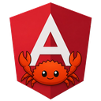

# rangular docs

  

Start at the [root README](../README.md) for a friendly overview. This folder
holds the contract and contributor habits.

| Doc | What it is |
| --- | --- |
| [`SPEC.md`](SPEC.md) | Language contract for **0.1.x** (what is in / out of scope) |
| [`CONTRIBUTING.md`](CONTRIBUTING.md) | Fixtures, diagnostics, PR habits |
| [`assets/`](assets/) | Project logo (`logo.png`, `logo-256.png`, `logo-128.png`) |

## Scope in one glance

- **In:** browser DOM via Leptos CSR / wasm, external `.html` + `.scss`, AOT by
  default, runtime for tests.
- **Out (v0.1):** full Angular, pipes / i18n / NgModule, **native desktop GUI
  toolkits**.

A [Tauri](https://v2.tauri.app/) (or similar) **webview** still counts as the
browser path: you ship the same wasm UI inside a desktop shell. That is not a
separate rangular backend.

## Related projects

External references (not dependencies):

- [Angust](https://github.com/TudorOrban/Angust) - Angular-style Rust GUI
  (native / desktop-oriented). Prefer this when you want widgets outside a
  webview.
- [Angular Rust](https://github.com/angular-rust) - Angular-inspired Rust UX
  ecosystem

rangular stays Leptos CSR / wasm first. See the root README for the Tauri
sketch and how that differs from Angust.
